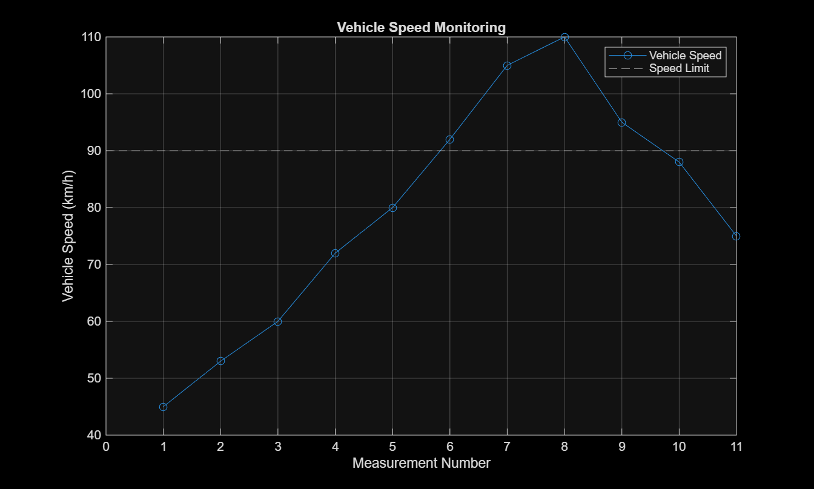
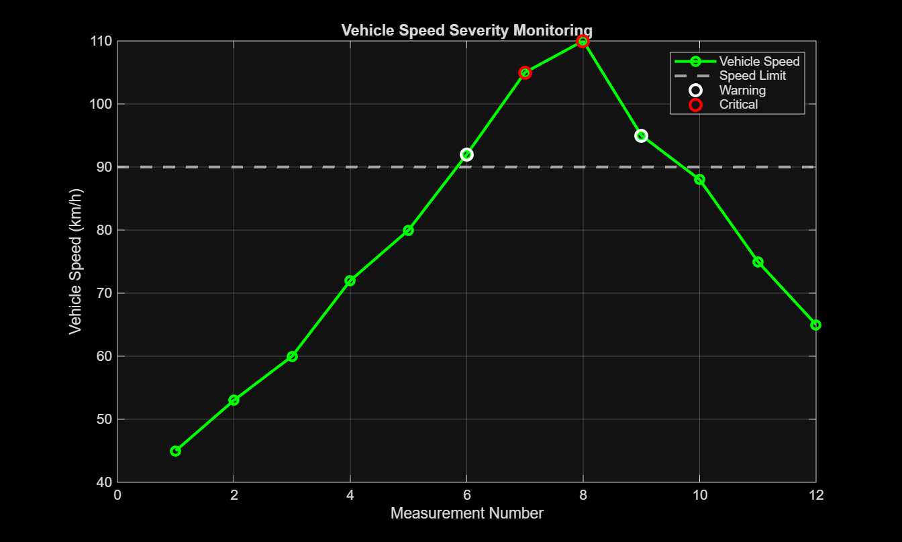

# 🚗 Vehicle Speed Monitoring System — MATLAB

A MATLAB-based **Vehicle Speed Monitoring System** designed to monitor vehicle speed, detect overspeeding conditions, classify severity levels, visualize speed data, simulate real-time monitoring, and store monitoring results in CSV format.

This project demonstrates the use of **MATLAB programming, modular functions, data processing, visualization, real-time simulation, and data logging** to develop a practical vehicle monitoring application.

---

## 📌 Project Overview

Vehicle overspeeding is an important road-safety concern. Continuous monitoring of vehicle speed can help identify unsafe driving conditions and provide useful information for further analysis.

This project implements a MATLAB-based monitoring system that analyzes vehicle speed measurements and classifies them into three categories:

| Speed Condition | Speed Range | Status      |
| --------------- | ----------: | ----------- |
| Normal          |   ≤ 90 km/h | 🟢 NORMAL   |
| Warning         | 91–100 km/h | 🟡 WARNING  |
| Critical        |  > 100 km/h | 🔴 CRITICAL |

The system also calculates speed statistics, generates graphical visualizations, performs a real-time monitoring simulation, and exports the results to a CSV data log.

---

## ✨ Key Features

* 🚦 Vehicle speed monitoring
* ⚠️ Automatic overspeed detection
* 🟡 Warning-level classification
* 🔴 Critical-level classification
* 📊 Maximum, minimum, and average speed calculation
* 📈 Speed visualization using MATLAB plots
* 📉 Overspeed and severity visualization
* ⏱️ Real-time monitoring simulation
* 💾 Automatic CSV data logging
* 🧩 Modular MATLAB function architecture
* 📄 Structured project report

---

## 🛠️ Technologies Used

* **MATLAB**
* MATLAB scripting and functions
* Data processing
* MATLAB plotting and visualization
* Tables and CSV file handling

---

## 📂 Project Structure

```text
Vehicle-Speed-Monitoring-System-MATLAB/
│
├── functions/
│   ├── calculateStatistics.m
│   ├── monitorSpeed.m
│   ├── saveSpeedLog.m
│   ├── main.m
│   └── vehicle_speed_log.csv
│
├── main.m
├── VehicleSpeedReport.md
├── vehicle_speed_graph.png
├── vehicle_speed_severity_graph.png
└── vehicle_speed_log.csv
```

---

## ⚙️ System Workflow

```text
                ┌───────────────┐
                │     START     │
                └───────┬───────┘
                        │
                        ▼
              ┌──────────────────┐
              │  Input Speed Data │
              └────────┬─────────┘
                       │
                       ▼
              ┌──────────────────┐
              │  Set Speed Limit │
              │     90 km/h      │
              └────────┬─────────┘
                       │
                       ▼
              ┌──────────────────┐
              │  Monitor Speed   │
              └────────┬─────────┘
                       │
              ┌────────┼─────────┐
              ▼        ▼         ▼
          NORMAL    WARNING   CRITICAL
          ≤90       91–100     >100
              └────────┼─────────┘
                       │
                       ▼
             ┌────────────────────┐
             │ Calculate Statistics│
             └─────────┬──────────┘
                       │
                       ▼
             ┌────────────────────┐
             │ Generate Graphs     │
             └─────────┬──────────┘
                       │
                       ▼
             ┌────────────────────┐
             │ Real-Time Simulation│
             └─────────┬──────────┘
                       │
                       ▼
             ┌────────────────────┐
             │ CSV Data Logging    │
             └─────────┬──────────┘
                       │
                       ▼
                ┌────────────┐
                │    END     │
                └────────────┘
```

---

## 🧩 MATLAB Functions

The project uses a modular programming approach to keep the implementation organized and maintainable.

### `main.m`

The main program controls the complete execution of the system.

It:

* Defines vehicle speed data
* Sets the speed limit
* Calls the speed monitoring function
* Calculates statistics
* Generates graphs
* Simulates real-time monitoring
* Creates the CSV data log

### `monitorSpeed.m`

This function analyzes every speed measurement and assigns a status:

```text
Speed ≤ 90 km/h       → NORMAL
90 < Speed ≤ 100 km/h → WARNING
Speed > 100 km/h      → CRITICAL
```

It also counts:

* Total overspeed events
* Warning events
* Critical events

### `calculateStatistics.m`

Calculates:

* Maximum speed
* Minimum speed
* Average speed

### `saveSpeedLog.m`

Creates a MATLAB table containing:

* Measurement time
* Vehicle speed
* Speed status

The table is then exported to:

```text
vehicle_speed_log.csv
```

---

## 📊 Test Data

The system was tested using the following speed measurements:

```text
45, 53, 60, 72, 80, 92, 105, 110, 95, 88, 75, 65 km/h
```

The configured speed limit is:

```text
90 km/h
```

---

## 📈 Results

The system produced the following results:

| Parameter          |     Result |
| ------------------ | ---------: |
| Speed Limit        |    90 km/h |
| Maximum Speed      |   110 km/h |
| Minimum Speed      |    45 km/h |
| Average Speed      | 78.33 km/h |
| Total Measurements |         12 |
| Overspeed Events   |          4 |
| Warning Events     |          2 |
| Critical Events    |          2 |

The system successfully identified both **Warning** and **Critical** overspeed conditions.

---

## 📸 Project Visualizations

### Vehicle Speed Monitoring



### Vehicle Speed Severity Monitoring



---

## 💾 Data Logging

The monitoring results are automatically stored in a CSV file:

```text
vehicle_speed_log.csv
```

The file contains:

| Column         | Description                 |
| -------------- | --------------------------- |
| `Time_Seconds` | Measurement time            |
| `Speed_km_h`   | Vehicle speed               |
| `Status`       | NORMAL / WARNING / CRITICAL |

Example:

```text
Time_Seconds,Speed_km_h,Status
0,45,NORMAL
1,53,NORMAL
2,60,NORMAL
3,72,NORMAL
4,80,NORMAL
5,92,WARNING
6,105,CRITICAL
7,110,CRITICAL
8,95,WARNING
9,88,NORMAL
10,75,NORMAL
11,65,NORMAL
```

---

## 📋 Requirements

Before running the project, make sure the following are available:

- MATLAB R2025b or compatible MATLAB version
- MATLAB scripts and user-defined functions
- A system capable of running MATLAB graphics
- Write permission for generating the CSV log file

### Required Project Files

The following files are required for the complete system:

- `main.m`
- `functions/monitorSpeed.m`
- `functions/calculateStatistics.m`
- `functions/saveSpeedLog.m`

The project does not require any external MATLAB toolbox beyond standard MATLAB functionality.

## ▶️ How to Run

### 1. Clone the repository

```bash
git clone https://github.com/meghkademani/Vehicle-Speed-Monitoring-System-MATLAB.git
```

### 2. Open MATLAB

Launch MATLAB and navigate to the downloaded project folder.

### 3. Add the functions folder to the MATLAB path

Make sure MATLAB can access:

```text
functions/
```

### 4. Run the main program

Open:

```text
main.m
```

and click **Run**.

The program will:

1. Analyze the speed data
2. Classify speed conditions
3. Display the monitoring summary
4. Generate graphs
5. Simulate real-time monitoring
6. Generate the CSV data log

---

## 🧠 Concepts Demonstrated

This project demonstrates practical understanding of:

* MATLAB programming
* Conditional statements
* `for` loops
* User-defined functions
* Arrays and strings
* Data classification
* Statistical calculations
* Data visualization
* MATLAB tables
* CSV file handling
* Real-time simulation
* Modular programming

---

## 🚀 Future Improvements

The current system uses predefined speed data. It can be extended into a more realistic vehicle monitoring solution by adding:

### 1. Real-Time Sensor Integration

Connect the MATLAB system to an actual vehicle speed sensor or external hardware to obtain live speed measurements.

### 2. Graphical User Interface

Develop a MATLAB GUI/dashboard showing:

* Current speed
* Speed limit
* Vehicle status
* Warning alerts
* Critical alerts
* Live graphs

### 3. Audio and Visual Alerts

Add alarms and visual notifications when the vehicle exceeds the permitted speed.

### 4. GPS Integration

Use GPS information to determine the vehicle's location and apply location-dependent speed limits.

### 5. Cloud Connectivity

Upload monitoring data to a cloud platform for remote monitoring and analysis.

### 6. Automatic Report Generation

Generate daily, weekly, or monthly vehicle speed reports automatically.

### 7. Machine Learning

Use historical speed data to identify driving patterns and predict potential overspeeding events.

---

## 🎯 Project Objective

The primary objective of this project is to demonstrate how MATLAB can be used to develop a practical vehicle safety application combining:

**Speed Monitoring → Classification → Statistics → Visualization → Real-Time Simulation → Data Logging**

---

## 👨‍💻 Author

**Megh Kademani**

Electronics and Communication Engineering Student

Interested in:

* Embedded Systems
* Electric Vehicles
* IoT
* MATLAB
* Electronics & Automation

---

## ⭐ Project Status

**Status:** Completed — Prototype / Simulation

The current version successfully demonstrates vehicle speed monitoring, overspeed classification, visualization, real-time simulation, and CSV data logging.

---

## 📜 License

This project is intended for **educational and academic purposes**.

## Future Improvements

- Add automatic speed-limit alerts.
- Improve real-time vehicle detection.
- Add graphical analysis of vehicle speed data.
- Extend the system for multiple speed zones.
